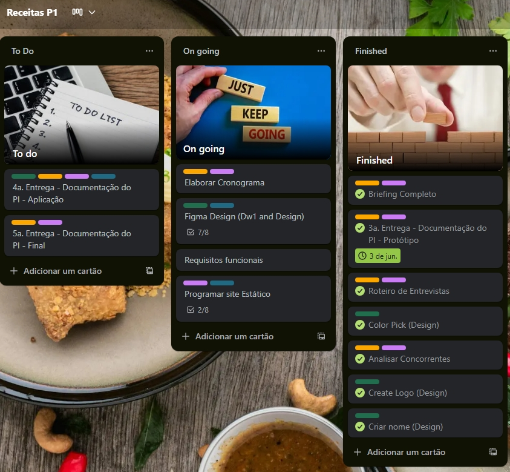
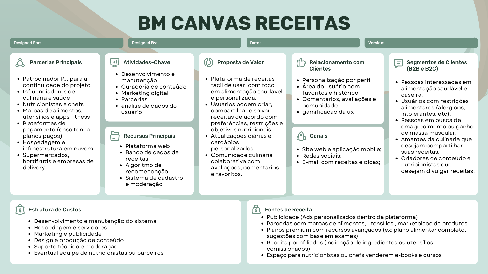
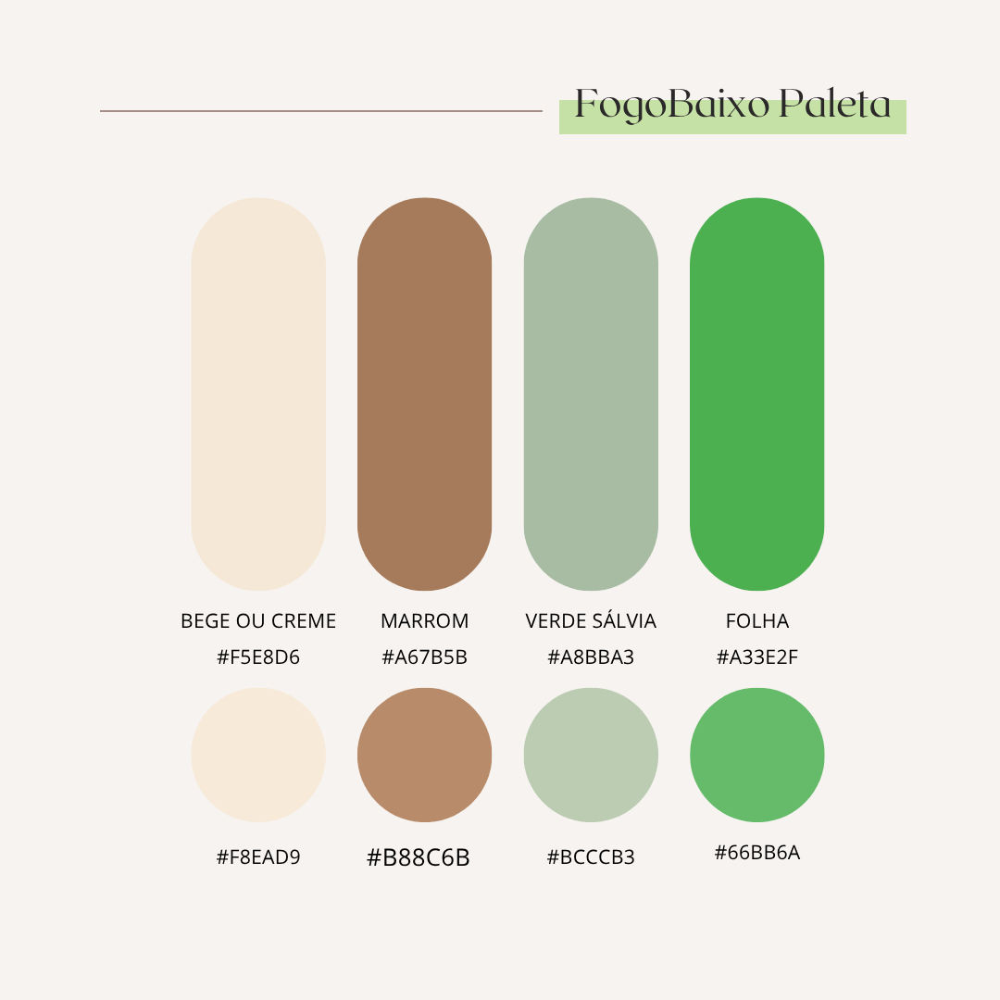
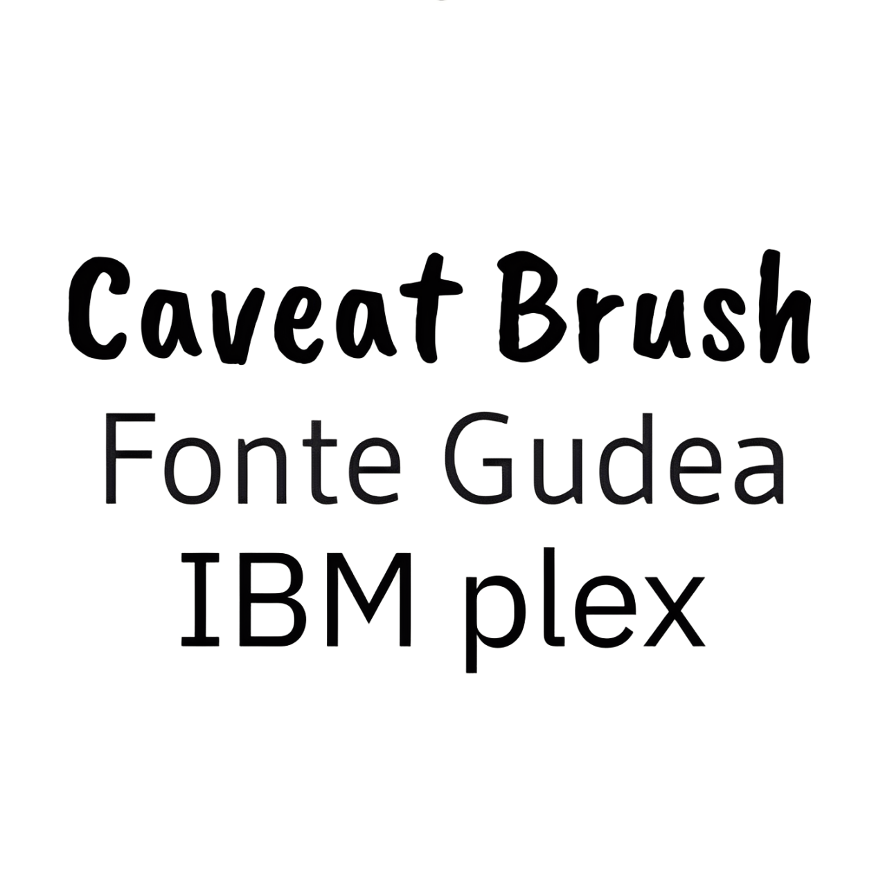
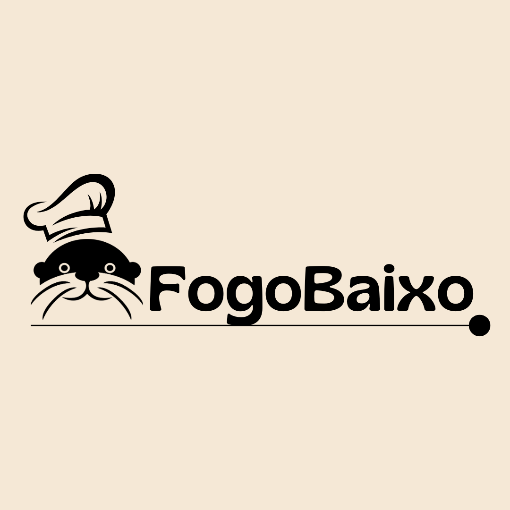
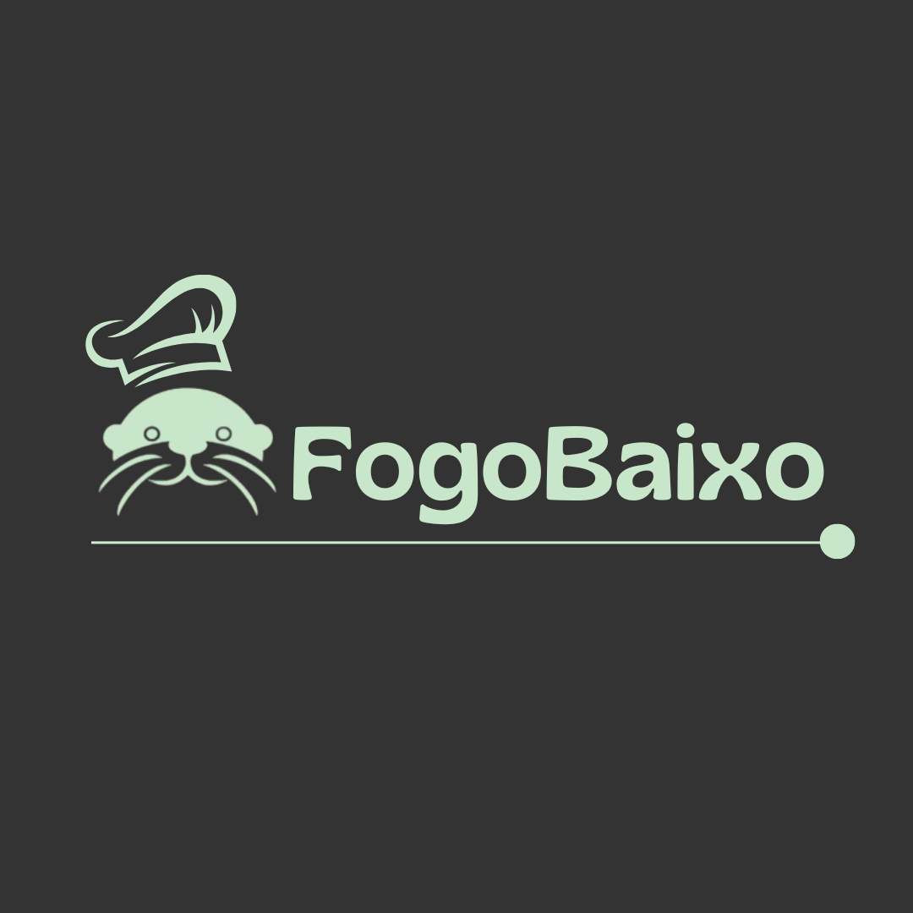
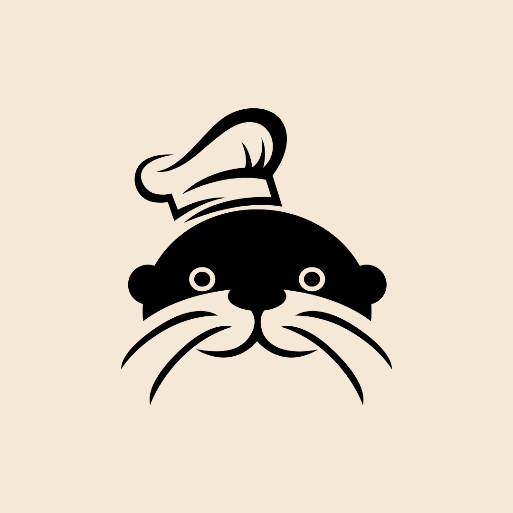
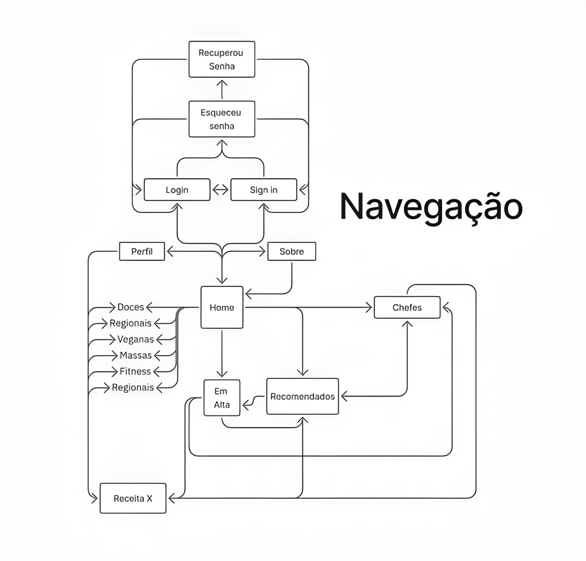
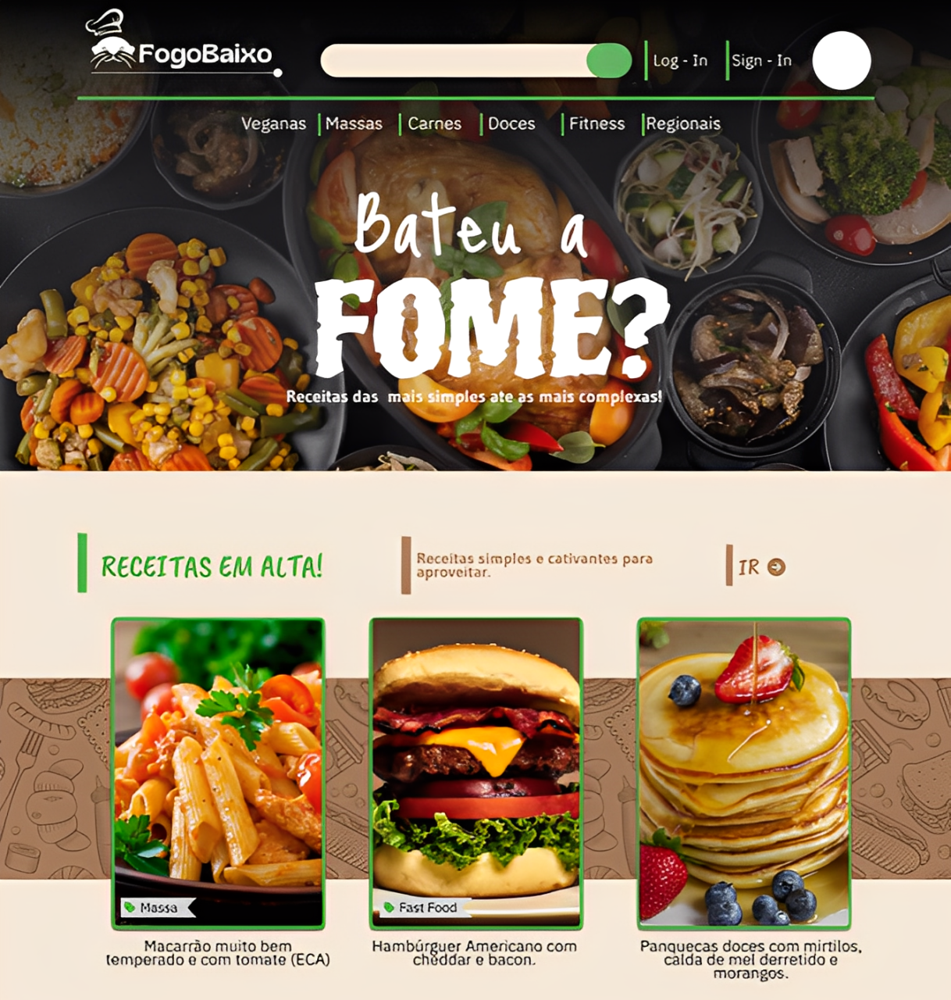

# 🍲 Fogo Baixo  
**Projeto para atender necessidades na área da alimentação**

    Centro Paula Souza 
    Faculdade de Tecnologia de Jahu 
    <h2>Curso de Tecnologia em Desenvolvimento de Software Multiplataforma</h2>
    <h2>Início: 1º Semestre / 2025</h2>

Documento da aplicação web

---

## 📖 Sumário
- [Descrição da Aplicação Web](#-descrição-da-aplicação-web)  
- [Objetivos](#-objetivos)  
- [Documento de Requisitos](#-documento-de-requisitos)  
- [Regras de Negócio](#-regras-de-negócio)  
- [Design](#-design)  
- [Modelo de Navegação](#-modelo-de-navegação)  
- [Prototipagem](#-prototipagem)  
- [Aplicação](#-aplicação)  
- [Considerações Finais](#-considerações-finais)  

---

## 🌐 Descrição da Aplicação Web

### 1.1 Descrição
Este projeto consiste no desenvolvimento de uma plataforma web de receitas interativa, voltada à promoção da alimentação saudável, prática e personalizada.
A aplicação permite que os usuários criem, compartilhem e salvem receitas, interajam com outros membros da comunidade e acessem conteúdos integrados às redes sociais.
Futuramente, o sistema poderá incluir integração externa com plataformas de compra de produtos alimentícios, mas o foco atual é a experiência culinária digital e o engajamento comunitário.

### 1.2 Métodos Utilizados (Front-End)
- **HTML5, CSS3, JavaScript**  
- **Tailwind CSS** → interfaces responsivas e consistentes  
- **Figma** → prototipagem e design de telas  
- **Scrum** → metodologia ágil baseada em sprints curtos e iterativos  

### 1.3 Cronograma do Projeto
📌 O cronograma detalhado está disponível em:  
👉 **[Receitas P1 | Trello](#)**  

---

## 🎯 Objetivos

### 2.1 Geral
Oferecer um ambiente digital eficiente, dinâmico e colaborativo para a comunidade culinária brasileira, que seja personalizável e interativo, atendendo diferentes perfis de usuários — desde iniciantes até profissionais.
O objetivo é promover a troca de experiências e o aprendizado coletivo, permitindo que todos compartilhem, conversem e se inspirem por meio da culinária.
Recursos adicionais incluem:
- Cupons, descontos e promoções exclusivas;
- Acompanhamento em tempo real de receitas e planos alimentares;
- Suporte direto e ágil aos usuários;
- Integração com redes sociais para compartilhamento e engajamento.

---

## 📑 Documento de Requisitos

Um **documento de requisitos de sistema** registra as especificações que o sistema deve atender, servindo como guia para equipe e stakeholders.  

### 3.1 ✅ Requisitos Funcionais (RF)

| Código | Descrição |
|--------|------------|
| RF01 | Cadastrar usuário |
| RF02 | Login e logout de usuários |
| RF03 | Gerenciar perfil do usuário |
| RF04 | Pesquisar receitas por nome, ingrediente ou categoria |
| RF05 | Filtrar receitas por restrições alimentares |
| RF06 | Salvar receitas favoritas |
| RF07 | Criar listas personalizadas (cardápios ou semanas) |
| RF08 | Compartilhar receitas em redes sociais |
| RF09 | Cadastrar e gerenciar receitas |
| RF10 | Visualizar receitas |
| RF11 | Interagir com receitas |
| RF12 | Página institucional |
| RF13 | Página de contato |
| RF14 | Página “Quem somos” |
| RF15 | Sistema de cupons/descontos |
| RF16 | Sistema de avaliação e comentários |
| RF17 | Sugestões automáticas com base no histórico do usuário |
| RF18 | Exibir produtos relacionados às receitas (ingredientes, utensílios, livros etc.) |
| RF19 | Integrar produtos de parceiros externos (via API ou catálogo próprio) |

---

### 3.2 ⚙️ Requisitos Não Funcionais (RNF)

| Código | Descrição |
|--------|------------|
| RNF01 | Usabilidade (site intuitivo e responsivo) |
| RNF02 | Desempenho (carregamento rápido) |
| RNF03 | Acessibilidade (WCAG, navegação por teclado, etc.) |
| RNF04 | Compatibilidade (multiplataforma e navegadores) |
| RNF05 | Segurança (criptografia, HTTPS, autenticação) |
| RNF06 | Manutenibilidade (código modular e documentado) |
| RNF07 | Escalabilidade |
| RNF08 | Reutilização de componentes |
| RNF09 | Alta disponibilidade |
| RNF10 | Backup e recuperação de dados |

---

### 3.3 📌 Casos de Uso
*(Inserir tabela/diagrama de casos de uso)*  

---

## 📊 Regras de Negócio

### 4.1 O que será realizado?
- Receitas personalizadas por perfil, restrições e objetivos  
- Plataforma colaborativa, simples e acessível  

| RN01 |– Todo conteúdo publicado deve estar relacionado a receitas, alimentação saudável ou temas culinários.
| RN02 |– Usuários podem publicar receitas próprias desde que sigam as políticas da plataforma (sem plágio, conteúdo ofensivo ou impróprio).
| RN03 |– Receitas devem conter título, ingredientes, modo de preparo e tempo de execução.
| RN04 |– Parceiros comerciais (marcas, nutricionistas, chefs, lojas) precisam de conta verificada para exibir produtos ou conteúdos patrocinados.
| RN05 |– Produtos de parceiros devem ser previamente aprovados pela equipe de curadoria.
| RN06 |– O sistema deve registrar comissões de vendas provenientes de afiliados.
| RN07 |– Anúncios e parcerias devem respeitar a categoria de conteúdo do usuário (ex: mostrar produtos fitness para quem busca receitas saudáveis).
| RN08 |– Planos premium devem liberar recursos adicionais, como cardápios personalizados e relatórios nutricionais.
| RN09 |– Receitas patrocinadas devem ser sinalizadas como tal na interface.
| RN10 |– Cada usuário deve ter um perfil único, com histórico de interações e receitas salvas.
| RN11 |– O sistema deve recomendar conteúdo com base nas preferências e restrições do usuário.
| RN12 |– Comentários e avaliações podem ser denunciados e serão moderados pela equipe técnica.
| RN13 |– A comunicação com usuários pode ocorrer via notificações, e-mail ou redes sociais integradas.
| RN14 |– Os usuários podem compartilhar receitas em redes sociais diretamente pela plataforma.
| RN15 |– Custos de hospedagem e manutenção devem ser provisionados mensalmente.
| RN16 |– A atualização do banco de dados e segurança do sistema devem ser realizadas de forma recorrente.

---

### 4.2 BM Canvas
- Modelo de negócios canva, organizando visualmente os objetivos e necessidades do projeto.

## 🎨 Design

- **Paleta de cores:** *(a ser definida)*
- 
- **Tipografia:** *(a ser escolhida)*
- 
- **Logo:** 
- 
- 
- 

### 4.4 Wireframe
Wireframe disponível no Figma:  
👉 [Acessar Wireframe](https://www.figma.com/design/vUViGgaIlrKPADdi3aWy3O/fogobaixo?node-id=482-46&p=f&t=5MafbUaEFfYEipWj-0)  

---

## 🧭 Modelo de Navegação

---

## 🖌️ Prototipagem
Protótipo criado no Figma:  
👉 [Acessar Protótipo](https://www.figma.com/design/vUViGgaIlrKPADdi3aWy3O/fogobaixo?t=5MafbUaEFfYEipWj-0)  

---

## 💻 Aplicação
Repositório do projeto disponível no GitHub:  
👉 [Acessar Repositório](#)  

---

## 📝 Considerações Finais
Durante o desenvolvimento do **Fogo Baixo**, utilizamos metodologias ágeis e iterativas, superando desafios de tempo e equipe reduzida.  
- Conversão de receitas em formatos digitais interativos  
- Organização em seções como *Painel de Controle*, *Avaliações* e *Resultados*  
- Ciclos curtos de desenvolvimento com Scrum  
- Expansão contínua de funcionalidades e banco de dados  

➡️ O projeto visa oferecer uma **abordagem inovadora na culinária brasileira**, unindo tecnologia, praticidade e experiência gastronômica.  

## Membros:

